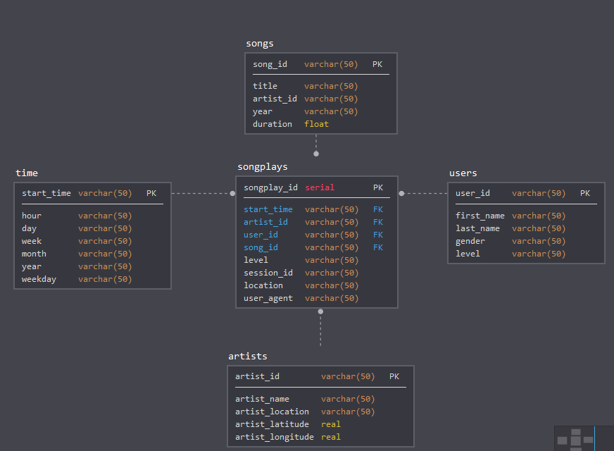

# Data Modeling with Postgres for Sparkify
****

# Purpose
****

For a startup company sparkify there is a need to analyze the data they've been collecting on songs and user activity on their new music streaming app. The analytics team is particularly interested in understanding what songs users are listening to. Currently, they don't have an easy way to query their data, which resides in a directory of JSON logs on user activity on the app, as well as a directory with JSON metadata on the songs in their app.

# Approach
****
In order to optimize queries on song play analysis, star schema is used with  fact table(songplays) and dimension tables(songs, users, artists and time). An ETL pipeline is create that transfers data from JSON files in two local directories into these tables in Postgres using Python and SQL. 

# Sample query
***
`SELECT count(*) FROM songplays WHERE level = 'paid' AND location = 'Tampa-St. Petersburg-Clearwater, FL' `

Result:
count
289

`SELECT user_id, level, song_id, artist_id FROM songplays WHERE song_id <> 'None' AND level = 'paid' LIMIT 5`

Result:

##### user_id 	level 	song_id 	artist_id
##### 15 	paid 	SOZCTXZ12AB0182364 	AR5KOSW1187FB35FF4
