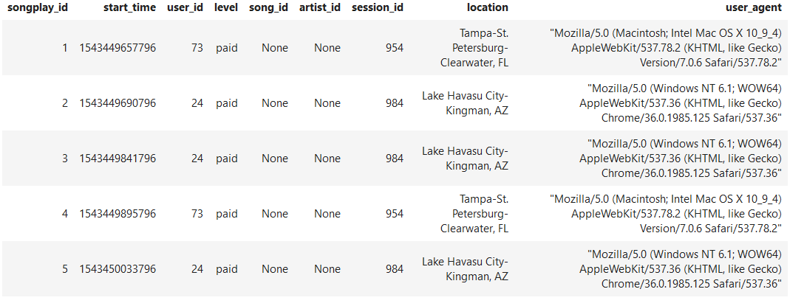
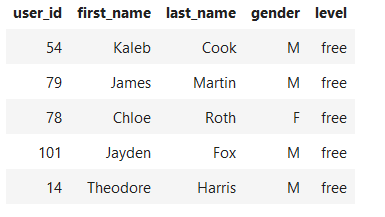
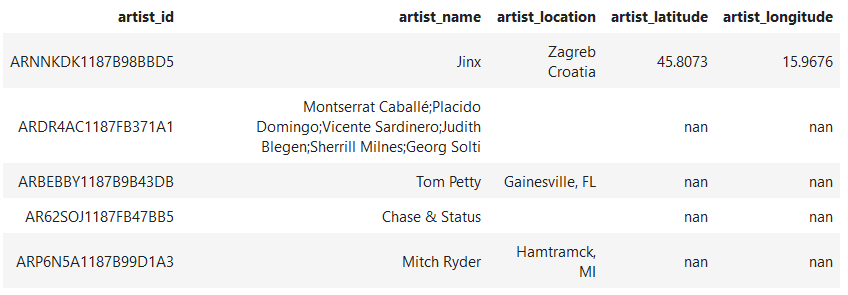
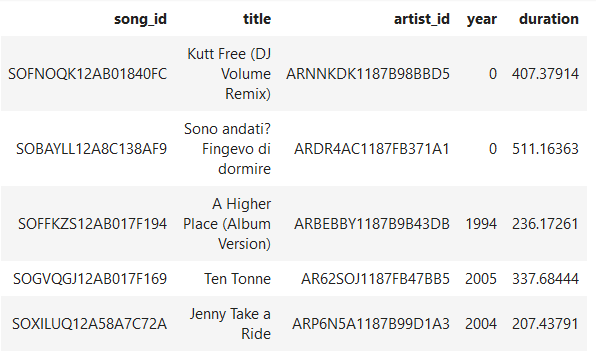

# Postgres Data model for Sparkify
****

# Purpose
****

The purpose of the newly created database is to move user activity and songs metadata which is stored in JSON format in sparkify music streaming app to well structured tables. Having properly desiged database will help to easily query specifc data and give an insite to Sparkify what songs users are listening to. 

# Approach
****
In order to optimize queries on song play analysis, star schema is used with  fact table(songplays) and dimension tables(songs, users, artists and time). Star schema has simpler structure which makes it easier to understand and good query effectiveness because we need small numer of tables to join. An ETL pipeline is used to transfer data from JSON files in two local directories into these tables in Postgres using Python and SQL. 

#### sql_queries.py  
Drops all tables if any exists then create all five tables with the rigt data type and constraints, once the tables are created, new recordes will be inserted into the tables - expects input values. 

#### create_tables.py
Imports queries from sql_queries.py and create a database connection, drop all tables and create all tables.

#### etl.py
Is the ETL pipeline that access log and song JSON files from local directory and iterate through them, extract the records, transofrm them to the right format and send the records to sql_queries.py to be inserted into the corsponding tables.   

### steps to run pipeline
- %run create_tables.py
- %run etl.py

# Sample query
***
`SELECT * FROM songplays LIMIT 5;`

`SELECT count(*) FROM songplays WHERE level = 'paid' AND location = 'Tampa-St. Petersburg-Clearwater, FL' `

Result:
count
289

`SELECT * FROM users LIMIT 5;`

`SELECT * FROM artists LIMIT 5;`

`SELECT * FROM songs LIMIT 5;`

`SELECT * FROM users LIMIT 5;`
